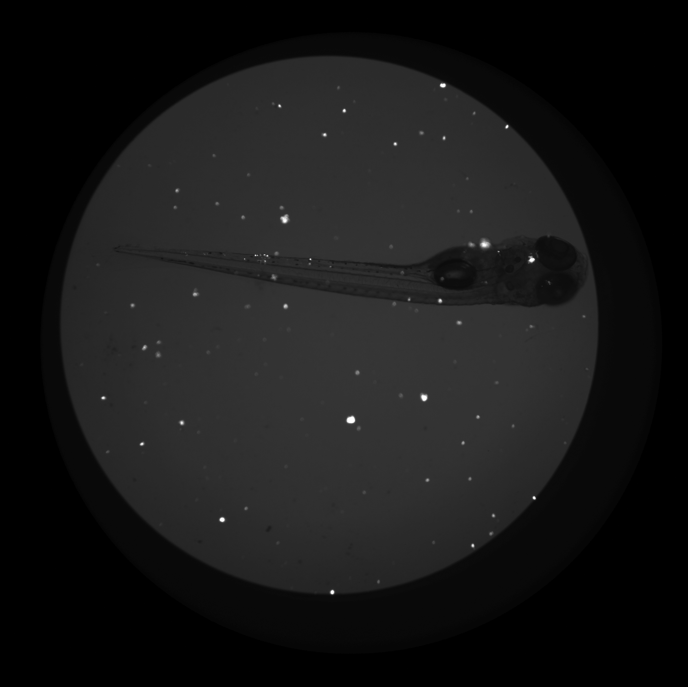
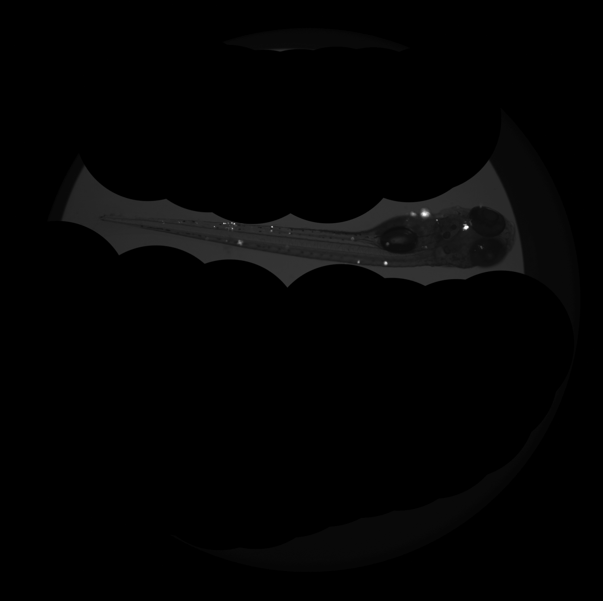

# Implementation of deep learning to automate fluorescent pixel counting in images of infected zebrafish

---

## Overview

### Data

The original dataset is from the lab of [Dr. Lalita Ramakrishnan](https://www.med.cam.ac.uk/ramakrishnan/). The images of fish and cropped fish were kindly shared with me, and I've done the pre-processing.

You can find it in folder data/fish.

The original image is of a zebrafish embryo infected with fluorescent bacteria and imaged in the fluorescence channel. This looks like:

The high level of background fluorescence means that to count the bright pixels inside the fish, ie. to quantify the level of infection, a researcher first manually crops out the area around the fish, resulting in the following image:

After the image has been cropped, the bright pixels are quantified by manually setting a threshold of brightness. 
The lab has hundreds-thousands of image pairs like this, so data for training is abundant. 

I propose to automate this process, and I would like to compare three different methods for doing this. 

### Method 1: Image Segmentation ML

The first approach is to train a neural network to detect bright pixels inside of the fish using an image segmentation algorithm. 
The neural network architecture to be implemented is the highly successful U-NET. 
The training data is generated from the original and cropped images.

The architecture was inspired by [U-Net: Convolutional Networks for Biomedical Image Segmentation](http://lmb.informatik.uni-freiburg.de/people/ronneber/u-net/).

The code for the network is largely adapted from https://github.com/zhixuhao/unet

This deep neural network is implemented with Keras functional API, which makes it extremely easy to experiment with different interesting architectures.

Output from the network is a 512*512 which represents mask that should be learned. Sigmoid activation function
makes sure that mask pixels are in \[0, 1\] range.

The model is trained for 5 epochs.

Loss function for the training is basically just a binary crossentropy.

### Method 2: Image subdivision and classification ML

While the U-NET segments the entire image, one could instead take a section, e.g. 10x10, around each bright pixel and classify the section as inside or outside of the fish, as in to count or to exclude. 

A CNN for image classification will be trained to output this binary result.

In prinicple, each image of an infected fish contains many such sections, so there is even more data available.

Also, the nature of the images suggests that inside the fish there are more features than outside, so it should be easy to detect differences.

### Method 3: Direct algorithm for determining whether a bright pixel is inside or outside of the fish

Similar to Method 2, the area around each bright pixel is directly analyzed. 

As mentioned above, inside of the fish, there should be a greater variation in the brightness of the surrounding pixels than if the bright pixel is outside of the fish. 

---

